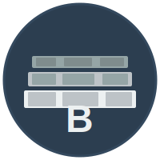

  
  
  # Bedrock Core
  
  **Build solid foundations for modern applications**
  
  
  

## About

Bedrock is a comprehensive application framework that provides a solid foundation for building modern, scalable web applications. This repository contains default community health files and configurations for the Bedrock Core organization.

## What is Bedrock?

Bedrock Core provides:

- 🏗️ **Solid Foundation** - Battle-tested architecture patterns and best practices
- 🚀 **Rapid Development** - Pre-configured templates and scaffolding tools
- 🔒 **Security First** - Built-in security features and authentication systems
- 📦 **Modular Design** - Flexible components that work together seamlessly
- 🌐 **Full Stack** - Complete solutions for both frontend and backend development

## Organization Repositories

Visit our [GitHub organization](https://github.com/bedrock-core) to explore our projects and tools.

## Community

We welcome contributions from the community! Check out our repositories to get started.

## License

Individual repositories may have their own licenses. Please refer to each repository for specific licensing information.